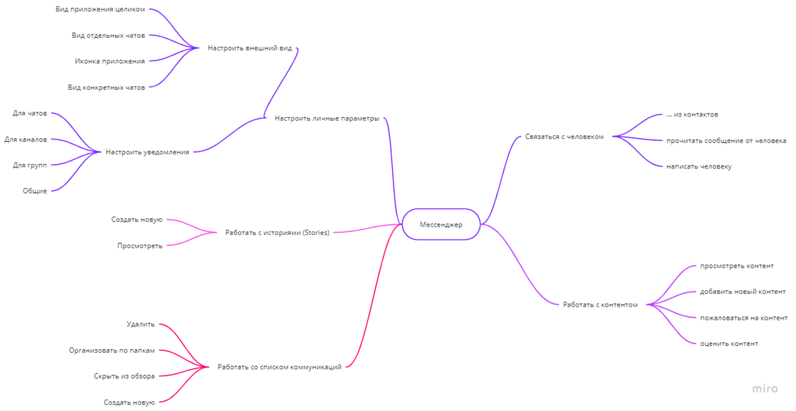
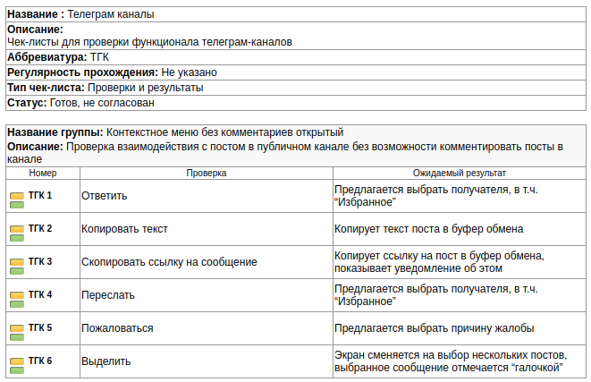

# Homeworks

Домашние задания по книге Ольги Назиной "Что такое тестирование"

## Задание 1.

Начните составлять собственное портфолио!

1. Выберите программу или сайт, которые используете часто.
2. Нарисуйте карту возможностей приложения.
3. Покажите другу, который в глаза не видел это приложение.
   Если друг поймет по вашей карте, что за приложение вы ему
   показываете и для чего оно нужно, а также какие его особен­
   ности самые главные, - поздравляю, вы справились с ДЗ!

[https://miro.com/welcomeonboard/SllVZmZmdjZGMExRSUNrOHhldm9YcU5obnltbUkzOHVCRTl1bDYzQWJJbFpxcTU4NDdsR0RKMVFTaWdrQUx1VXwzNDU4NzY0NTI5MTc3NDk0MzAxfDI=?share_link_id=463474012934](https://miro.com/welcomeonboard/SllVZmZmdjZGMExRSUNrOHhldm9YcU5obnltbUkzOHVCRTl1bDYzQWJJbFpxcTU4NDdsR0RKMVFTaWdrQUx1VXwzNDU4NzY0NTI5MTc3NDk0MzAxfDI=?share_link_id=463474012934)

В карте загадан мессенджер Телеграм

## Задание 2.

Зная информацию с картинок: какие файлы умеет обрабатывать система
и какие типы данных она в состоянии обработать, - придумайте тест-кейсы
на обработку данных.
Помните, что тесты должны быть полезными. Нет смысла пытаться
проверить через файл саму возможность чего-то (исправление опечаток,
определение пола, транслитерация). Но и не надо придумывать сложные
тесты, которые вы будете составлять целую неделю.

[ОД-1. Загрузка подходящего файла Excel]

0. Подготовить файл Excel, подходящий под условия сервиса.
1. Нажать кнопку «Выбрать файл».
2. Указать созданный заранее файл, подтвердить выбор.

ОП: файл успешно загружен, можно продолжить работу с сервисом.

[ОД-2. Загрузка подходящего файла CSV]

0. Подготовить файл CSV, подходящий под условия сервиса.
1. Нажать кнопку «Выбрать файл».
2. Указать созданный заранее файл, подтвердить выбор.

ОП: файл успешно загружен, можно продолжить работу с сервисом.

[ОД-3. Загрузка файла через выбор файла]

0. Скачать «Пример файла для обработки» или подготовить файл, подходящий под условия сервиса.
1. Нажать кнопку «Выбрать файл».
2. Указать необходимый файл, подтвердить выбор.

ОП: файл успешно загружен, можно продолжить работу с сервисом.

[ОД-4. Загрузка файла drag-n-drop]

0. Скачать «Пример файла для обработки» или подготовить файл, подходящий под условия сервиса.
1. В файловом менеджере зажать ЛКМ на нужном файле, перенести его в зону загрузки в сервисе.

ОП: курсор после нажатия ЛКМ изменится с обычной стрелки на перемещение объекта и не изменится до отпускания ЛКМ.

2. После наведения в поле загрузки отпустить ЛКМ.

ОП: файл успешно загружен, можно продолжить работу с сервисом.

[ОД-5. Загрузка открытого файла]

0. Подготовить файл Excel, подходящий под условия сервиса.
1. Открыть созданный файл в Excel.
2. Нажать в сервисе кнопку «Выбрать файл».
3. Указать созданный заранее и открытый файл, подтвердить выбор.

ОП: файл успешно загружен, можно продолжить работу с сервисом.

## Задание 3.

Напишите два тест-кейса на свое приложение: один с результатом на каждый шаг, второй с одним результатом.

Напишите чек-лист на любой функционал.

См. Telegram

### Тест-кейсы

[ТТК-1 Комментарий при отправке в избранное]

0. Залогиниться в Telegram Desktop под любой учёткой (см. ТТК-логин)
1. Пройти в любой телеграм-канал (например, https://t.me/spinuchan или он же `@spinuchan`)
   ОП: отобразится до 24 однообразных постов канала "spinu".
2. Кликнуть ПКМ по любому посту.
   ОП: появится контекстное меню в 5+ пунктов.
3. Кликнуть ЛКМ на пункт меню "Ответить".
   ОП: появится список чатов и групп, в которые можно отправить этот пост.
4. Выбрать получателя "Избранное".
   ОП: появится экран переписки в "Избранном" и подготовленный блок ответа. Кнопка "Отправить" не отображается.
5. Написать любой текст, например, `Lorem ipsum`.
   ОП: после первого символа кнопка голосового/видеосообщения изменится на значок отправки.
6. Нажать "Отправить" (стрелка вправо).
   ОП: сообщение отправится, значок  отправки поменяется обратно на голосовое/видеосообщение, в переписке появится следующее сообщение с отвеченным постом и текстом из п. 5

ОП: создалось новое сообщение в переписке "Избранное" с возможностью перейти к оригиналу ответа.

[ТТК-2 Пересылка сообщения из канала]

0. Залогиниться в Telegram Desktop под любой учёткой (см. ТТК-логин)
1. Пройти в любой телеграм-канал (например, https://t.me/spinuchan или он же `@spinuchan`)
2. Кликнуть ПКМ по любому посту.
3. Кликнуть ЛКМ на пункт меню "Переслать".
4. Выбрать получателя "Избранное".

ОП: создалось новое в переписке "Избранное" с возможностью перейти к оригиналу и без комментариев.

### Чек-лист

Также лежит в XML рядом.
